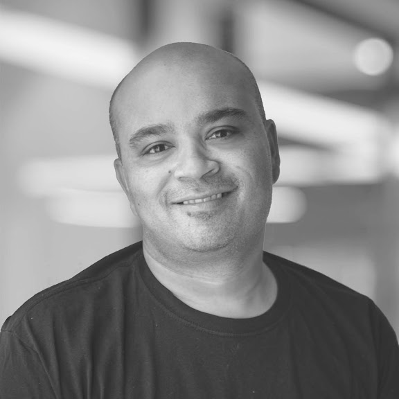

{: .mx-auto.d-block}

With over two decades of experience in the SaaS ecosystem, I've navigated the complexities of scaling startups from early stage to high-growth. As the founder of a successful EdTech company and former Fractional Head of Engineering at Shoelace Learning, I bring a wealth of hands-on experience to your team.

My mission? To empower your startup with the engineering leadership it needs to thrive.

